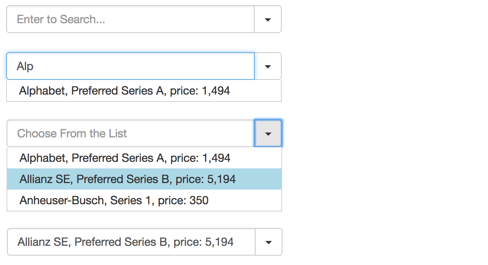

# can-search-select

[](https://travis-ci.org/icanjs/can-search-select)

CanJS component for a dropdown select with a search



To try out the demo open `demo.html` file in browser.

## Example

Your page template can look like this:
```html
<can-import from="can-search-select" />
<can-search-select {items}="items"
                   filter-prop-name="companyName"
                   {format}="@format"
                   {format-input}="@formatInput"
                   {^selected-item}="selectedItem" />
```

Your view model can look like this:
```js
const vm = new DefineMap({
  selectedItem: null,
  items: [{
    companyName: 'Alphabet',
    issuanceName: 'Preferred Series A',
    price: '1,494'
  }],
  format (item) {
    return item.companyName + ', ' + item.issuanceName + ', price: ' + item.price;
  },
  formatInput (item) {
    return item.companyName;
  }
})
```

## API

__Main props:__
- `items`, a list of source items;
- `selected-item`, the selected item, can also be used for preselection;
- `filter-prop-name`, string, a property name to search against;
- `format`, a function that receives the selected item and returns a value for rendering in the input, default will use `filterPropName` or the item itself;
- `format-input`, a function to format the input field value.

__Customization options:__
- `placeholder-search`, default `Enter to Search...`;
- `placeholder-select`, default `Choose From the List`;
- `btnClass`, default `caret` (for TwBootstrap caret).

## Usage

### ES6 use

With StealJS, you can import this module directly in a template that is autorendered:

```js
import 'can-search-select';
```

### CommonJS use

Use `require` to load `can-search-select` and everything else
needed to create a template that uses `can-search-select`:

```js
require("can-search-select");
```

### Standalone use

Load the `global` version of the plugin:

```html
<script src='./node_modules/can-search-select/dist/global/can-search-select.js'></script>
```

## Release Notes
- `0.2.2`:
  - added `format-input` param.
- `0.2.1`:
  - styled dropdown list;
  - use `selectedItem` for preselection.
- `0.2.0`:
  - finalized main params and customization options.
